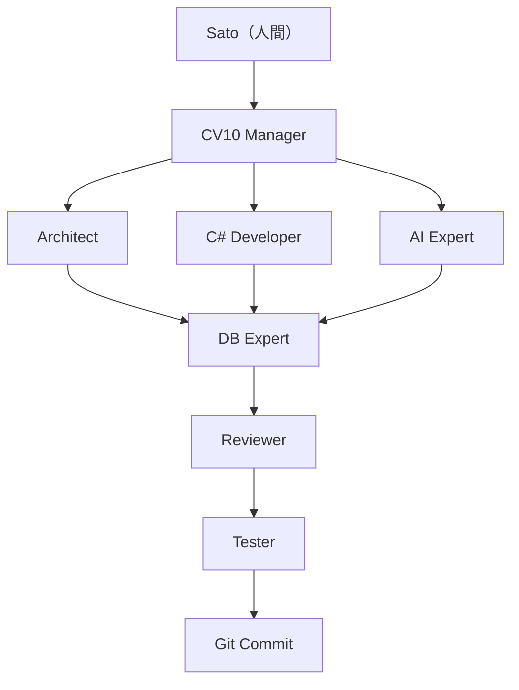

# CV10 大規模設計案件エキスパート引継ぎ規約

## 1. 目的と適用範囲

本書は、設計から開始する大規模な CV10 案件だけに適用する。通常の保守、局所修正、単一画面の改善には [`handoff.md`](handoff.md) を使用し、本書を使わない。

次のいずれかを含み、Sato（人間）または CV10 Manager が「大規模設計案件」と明示した場合に適用する。

- 新しい業務機能を複数レイヤーへ追加する、または既存業務の意味論を変更する。
- DBスキーマ・データ移行・外部契約・認可・定時処理を伴う。
- 段階導入、後方互換、ロールバック、複数リポジトリまたは複数チームの調整を要する。
- AI・予測・最適化などで、データ品質、評価指標、運用監視の設計を要する。

本書は `AGENTS.md` と `handoff.md` の安全規約、ファイル所有権、文字コード、検証、Git規約を置き換えない。矛盾時は `AGENTS.md`、次に `handoff.md`、最後に本書の順で従う。

## 2. 役割の主鎖



この図は責任の主鎖であり、同一時点での同一ファイル編集を許可するものではない。Architect、C# Developer、AI Expert は調査・実現性確認を並行できるが、設計確定前に本番ソースを編集しない。C# Developer の実装は、設計レビューとSatoの承認後に開始する。

## 3. 役割と完了責任

| 役割 | 責務 | 設計段階の変更権限 | 完了条件 |
| --- | --- | --- | --- |
| Sato（人間） | 目的、優先順位、業務上の受入条件、仕様判断、コミット承認を決定する | すべての業務判断 | 設計承認または差戻しを明示する |
| CV10 Manager | 案件憲章、範囲、担当、所有権、ゲート、最終判断材料を管理する | 原則なし | 根拠のある統合引継ぎをSatoへ提示する |
| Architect | レイヤー構成、既存資産、依存、段階導入、非機能要件、最小設計を定義する | なし | 実装可能な設計と未決事項を提示する |
| C# Developer | 既存コードの実現性、実装分割、互換性、テスト可能性を確認し、承認後に実装する | 設計段階はなし。承認後は割当ファイルのみ | 承認済み設計どおりに実装・自己検証する |
| AI Expert | AI採用の妥当性、データ品質、評価指標、再現性、説明可能性、外部AI契約を評価する | なし | AI非該当ならその根拠を、該当なら安全な設計条件を提示する |
| DB Expert | 物理モデル、SQLite互換性、移行、整合性、性能、バックアップ・ロールバックを査定する | なし。承認後のDB資産変更は明示委任時のみ | 移行・復旧・既存データ互換性を含むDB引継ぎを承認する |
| Reviewer | 設計および実差分を独立確認し、設計逸脱・回帰・保守性・安全性を評価する | なし | 根拠を付けて承認、要修正、提案のみを判定する |
| Tester | 受入条件を実行可能なケースへ変換し、実装担当と独立して検証する | 原則なし。テスト資産は明示委任時のみ | 正常・境界・異常・移行・ロールバックの結果を記録する |

AI Expert は、AI機能を必ず導入する役割ではない。AI・予測・最適化・外部AI連携が要件に無い場合でも、「非採用でよい根拠」と、将来拡張のために残すべき境界を明記して完了する。

## 4. ゲートと実行順序

### Gate 0: 案件開始

CV10 Manager は `EXPERT_INITIATIVE` を作成する。少なくとも、目的、業務上の成功条件、非目標、制約、対象利用者、影響するレイヤー、既存差分、想定リスク、Satoに求める判断を含める。

### Gate 1: 並行調査

Architect、C# Developer、AI Expert は読取専用で独立に調査する。出力は互いの結論を前提にせず、コード・契約・データの根拠を添える。

- Architect: `ARCHITECT_EXPERT_HANDOFF`
- C# Developer: `C_SHARP_FEASIBILITY_HANDOFF`
- AI Expert: `AI_EXPERT_HANDOFF`

### Gate 2: DB統合設計

DB Expert は三つの調査結果を照合し、データモデル、制約、SQLite SQL、移行順序、既存データの変換、ロールバック、容量・性能を `DB_EXPERT_HANDOFF` にまとめる。DB非該当でも、非該当根拠を記載して通過させる。

### Gate 3: 設計レビューとSato承認

Reviewer は、設計がCV10の層構造、V*列の不変条件、gRPC契約、WPF境界、移行安全性、非機能要件に適合するかを確認する。CV10 Manager は全引継ぎを `EXPERT_DESIGN_DECISION` として統合し、Satoへ提示する。

Satoの明示承認なしに、仕様・DB・公開契約・既存動作を変える実装を開始しない。

### Gate 4: 実装と専門確認

C# Developer が承認済みのファイル所有権内で実装し、単体・対象ビルド・差分検査を行う。DB変更がある場合は、DB Expert が実装された移行、既存DB、復旧手順を再確認する。

### Gate 5: 実装レビューと受入テスト

Reviewer は実際の `git diff` と関連経路を確認する。Tester はレビュー済みの候補に対し、受入シナリオを独立実行する。少なくとも次を対象にする。

- 正常系、境界値、異常系、権限・例外処理
- 既存データからの移行、再実行の冪等性、失敗時の復旧またはロールバック
- 実際の WPF 操作、gRPC 境界、Scheduler、外部連携など変更した経路
- 性能・容量・監視要件がある場合の測定結果

TesterまたはReviewerが要修正とした場合は C# Developer へ戻し、該当ゲートの検証をやり直す。

### Gate 6: Git Commit

CV10 Manager は、対象差分、作業ログ、Reviewer承認、Tester結果、未解決リスクを再確認する。Satoが明示して承認したときだけ、限定されたファイルをコミットする。承認が無い場合は、コミット候補と検証結果を引継いで完了する。

## 5. 専門引継ぎの共通形式

すべての引継ぎは日本語で作成し、推測を事実として書かない。該当しない項目は「なし」とする。

```text
[種別]
案件・担当範囲:
前提・既存差分:
確認した事実と根拠:
提案または検証結果:
影響範囲・互換性:
リスクと緩和策:
ファイル所有権:
検証・受入条件:
未決事項とSato判断の要否:
次ゲートへの引継ぎ:
```

`EXPERT_DESIGN_DECISION` には、採用案・不採用案、段階導入、ロールバック、受入基準、実装順、テスト戦略、承認者を必ず含める。

## 6. モデルと作業割当

モデル選定は [`handoff.md` の「モデル選定」](handoff.md#9-モデル選定)を共通規約とする。大規模案件では、CV10 Manager、Architect、DB Expert、重要業務のReviewerには原則として `gpt-5.6-sol` を用いる。C# DeveloperとTesterは、設計が確定した分割可能な作業では `gpt-5.6-terra` を用いてよい。

`gpt-5.6-luna` は、ファイル棚卸し、定型分類、テスト観点の収集に限る。設計判断、DB判断、実装、最終レビュー、最終Tester判定を単独で担わせない。モデルの利用可否は実行環境で確認する。

## 7. 共有ワークスペースと中断条件

- 同じファイル、migration、プロジェクトファイル、共有リソース、`Doc/aicoding_log.md` を同時に編集しない。統合担当をCV10 Managerが指定する。
- 設計段階の調査担当は本番ソースを編集しない。試作が必要なら、`.omo/` の明示的な検証資料だけに限定する。
- 既存の未コミット変更、未追跡ファイル、他担当の差分は削除・stash・reset・整形しない。
- 仕様矛盾、データ破壊リスク、移行不能、公開契約の互換性喪失、必要なSato判断の欠落を発見したら、次工程へ進めずCV10 Managerへ差し戻す。
